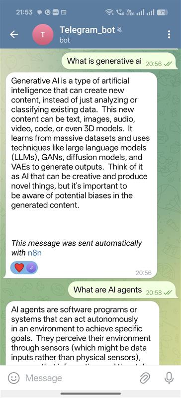
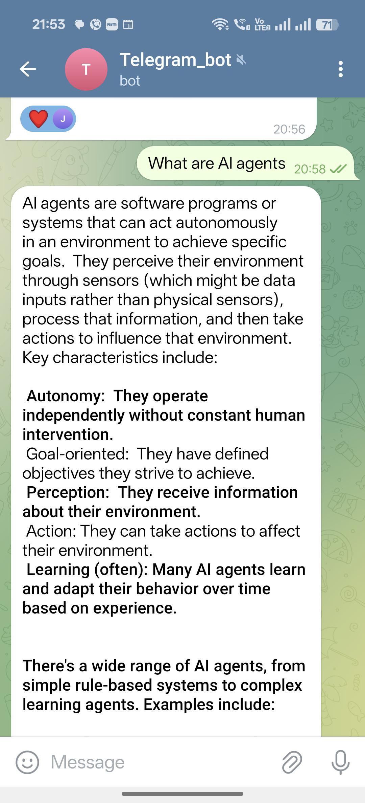

# 🤖 Build AI Agents with n8n + Telegram + Gemini + Real-Time APIs

Welcome to this beginner-friendly project where we build AI agents using **n8n**, **Telegram**, **Gemini**, and real-time APIs like **Wikipedia**, **Hacker News**, and **SERP API** — all without writing much code! 🔧

---

## 🧠 AI Agents: The Next Evolution Beyond LLMs

The rise of **AI Agents** marks a new phase in intelligent systems. Unlike traditional **Large Language Models (LLMs)** that simply respond to input text, **AI agents** can:

- 🧩 Reason  
- 📋 Plan  
- 🛠️ Use tools  
- 🧠 Remember conversations  
- ⚙️ Take autonomous actions  
- 🔄 React to dynamic environments  

> 💡 In simple terms:  
> ❌ LLM: Gives a list of news headlines  
> ✅ AI Agent: Fetches today's news, filters it by your interest, and messages it to you via Telegram — every morning!

---

## ⚡ Why Everyone Wants to Build AI Agents

AI agents unlock capabilities that make them ideal for solving real-world problems:

- 🌍 **Autonomy**: No need for constant prompts  
- 🔗 **Tool-Use**: Use APIs, databases, and external services  
- 💾 **Memory**: Retain and reference previous context  
- 🕹️ **Multi-step reasoning**: Break down complex tasks into actions  

Use cases include:
- 📞 Customer support  
- 🧪 Research assistants  
- 📅 Personal life organizers  
- 📊 Automated dashboards  
- 🤖 Chat interfaces on mobile  

---

## 🧰 Popular Ways to Build AI Agents

| Tool        | Approach                       | Best For                              |
|-------------|-------------------------------|----------------------------------------|
| **LangChain** | Code-based (Python)           | Devs needing custom logic and control |
| **AutoGen**   | Multi-agent architecture       | Task orchestration, agent collaboration |
| **CrewAI**    | Role-based teamwork            | Agents solving problems together       |
| **n8n**       | Visual low-code/no-code        | Fast prototyping, integration-friendly |

---

## 🚀 What We Built (Using n8n)

We chose **n8n**, a visual automation platform, to build AI agents that connect seamlessly with:

- 📱 **Telegram** – for user interaction  
- 🧠 **Gemini Chatbot** – as the core AI brain  
- 🗃️ **Memory module** – for storing user context  
- 🔗 **APIs** – like Wikipedia, Hacker News, and SERP for real-time information  

---

### 🔄 Agent Flow 1: Conversational Memory Agent

This flow helps users retrieve real-time, up-to-date information directly from their phone by chatting with the Telegram bot.

---

### 🔄 Agent Flow 2: Real-Time News/Info Agent

This flow fetches and filters news or information based on user preferences and sends it via Telegram.

---

## 📁 What's Inside This Repo

| File / Folder                  | Description                                          |
|-------------------------------|------------------------------------------------------|
| `README.md`                   | Project overview and instructions                   |
| `Telegram_Agent.json`         | n8n flow for the Gemini + memory chatbot agent       |
| `telegram_3.json`             | n8n flow for real-time news/info agent               |
| `result1.jpg`                 | Screenshot of the conversational memory agent flow  |
| `result2.jpg`                 | Screenshot of the real-time news/info agent flow    |
| `workflow1.png`               | Step-by-step explanation of the memory agent setup  |
| `workflow2.png`               | Step-by-step explanation of the news agent setup    |
| `workflows/`                  | Folder containing additional workflow configurations|

---

## ✅ Final Thoughts: Why This Matters

Learning and building with AI agents is not just a trend — it's a future-ready skillset.

Through this project, you'll:
- 🔧 Build usable agents without backend-heavy setups
- 📱 Enable real-time, mobile-friendly AI interactions
- 🧠 Understand how LLMs + memory + APIs = actual useful tools

> 🎯 The real benefit?  
> You don’t just learn to **use AI**, you learn to **make AI useful.**

This repo is perfect for:
- Beginners exploring AI automation  
- Devs experimenting with agents  
- Builders who want to deploy chatbots with real-world power  

Let’s build smarter, not harder. 💡

---

## 📌 Stay Tuned

More features and advanced flows will be added soon.  
Feel free to clone, fork, or star this repo ⭐  
Have questions or ideas? Drop them in the issues tab!

---
